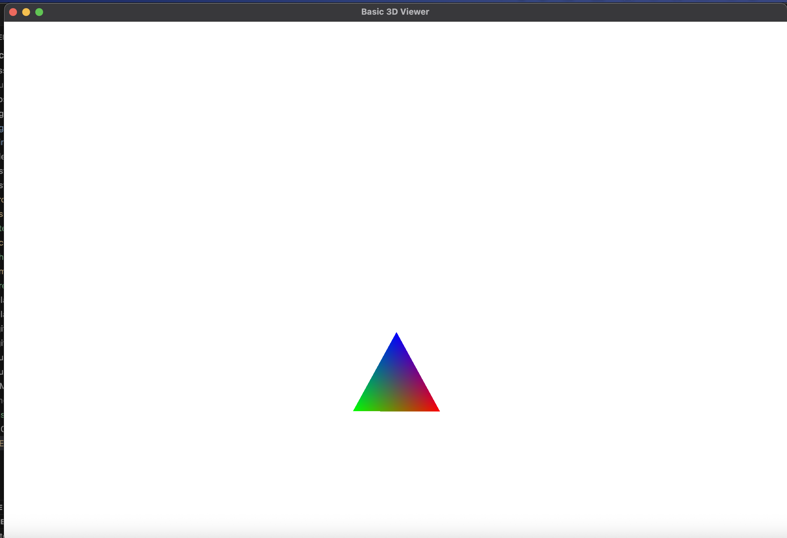
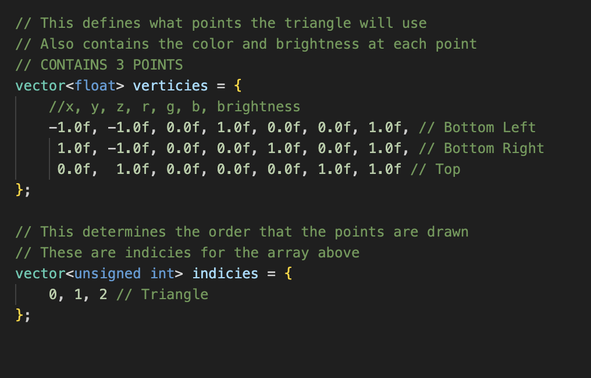

> This task is relevant for **voxel engine**


# CS Club Open Source Team Recruitment Technical Assessment: Graphics


> **YOU DON'T NEED TO COMPLETE ALL PARTS.** 

To complete this assessment, you will need to fork and clone this repo, implement and push your solutions to GitHub, and send a link of your fork to our Open Source & Infrastructure Manager Phoenix (pbird99) on Discord.

Note that this repository contains ALL questions for our technical screening and you are NOT required to attempt all questions!


## Building and running

### Linux, Mac OS, MSYS (Windows)

```sh
./build.sh
```

### Windows - Visual Studio

```bat
.\build.bat
```

### Install

Refer to install.md for any debug steps for installing libraries


## What you are provided

You are given the basic engine and some template code for generating a single triangle.



<br>
Create using the following verticies in main.cpp




## Task 1: Create a Cube
Replace the current triangle with a 3D cube.

**Hints**:
- A cube has 8 vertices and 12 triangles (2 per face)
- You'll need to modify the `verticies` and `indicies` vectors in `main.cpp`
- Remember the vertex format: `x, y, z, r, g, b, brightness`
- Consider which vertices connect to form each face
- Think about triangle winding order (clockwise vs counter-clockwise)


## Task 2: Simple Collision Detection
Implement basic collision detection to prevent the camera from moving through objects.

**Hints**:
- Add a collision detection function that checks camera position against object boundaries
- Modify the camera movement code in the main game loop
- Consider using simple bounding boxes or sphere collision
- You might want to store object positions and sizes in a data structure
- Think about how to "push back" the camera when it hits something


## Task 3: Basic Game - Maze or Platformer
Create a simple game using your collision system. This doesn't need to be too complicated, its more to teach you how to work with the rendering and collision logic to actually create something.

**Examples**:
1. **Maze Game**: Create walls the player must navigate around
2. **Platform Game**: Add gravity, jumping, and platforms to jump on

**Hints**:
- Use multiple cubes/objects to create your game world
- For a maze: Create wall objects and use collision to prevent walking through them
- For a platformer: Implement gravity (downward acceleration) and ground collision
- Consider adding a simple goal system (reach a target location)
- You might want to create a level data structure to define object positions
- Think about game state management (win/lose conditions)


## Additional Challenges

Once you complete the main tasks, try these advanced features:
- Multiple objects with different properties
- Animation and movement of objects
- Sound effects
- More complex collision shapes
- Particle effects

## File Structure

- `src/main.cpp` - Main application and game loop
- `src/camera.h` - Camera class definition
- `src/render.h` - Rendering system
- `src/header.h` - Common includes and definitions
- `src/shaders/` - Vertex and fragment shaders
- `lib/` - External libraries (STB image, etc.)
- `makefile` - Build configuration for multiple platforms

